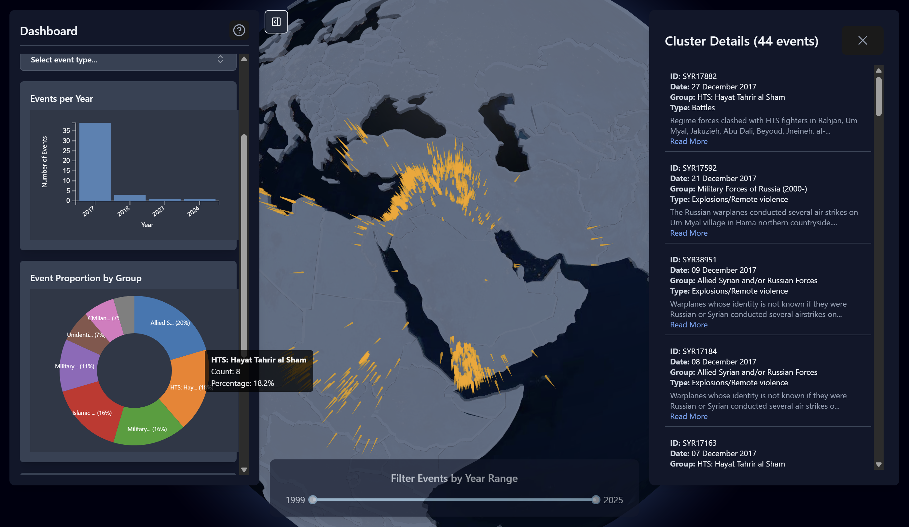
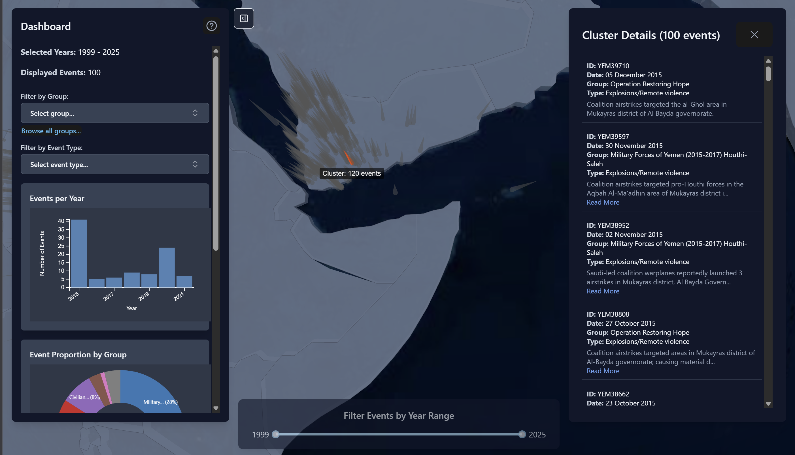
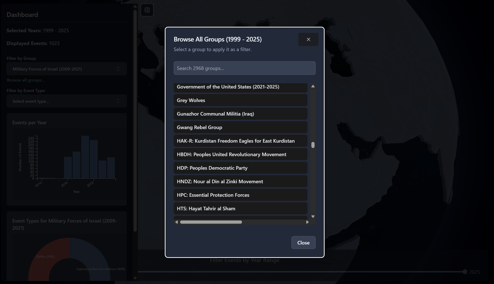
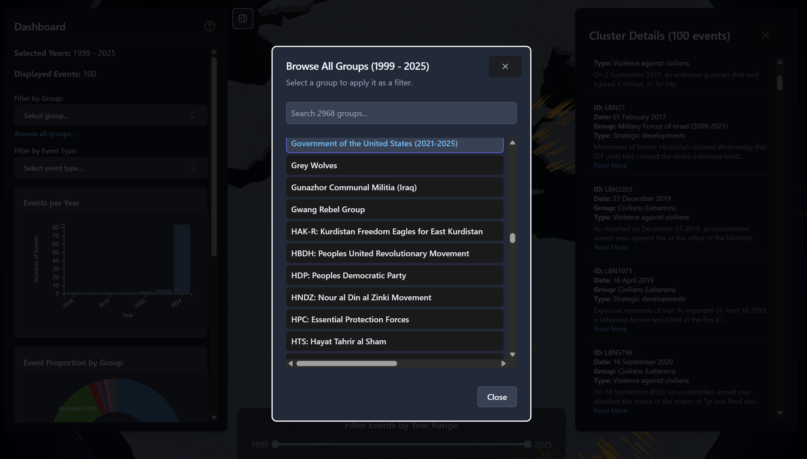

# MENA Conflict Tracker

[Live demo](https://conflict-tracker-ten.vercel.app/)

Interactive 3D globe showing geopolitical events in the Middle East and North Africa region (1999 -- May 2025). Data from [ACLED](https://acleddata.com).

## Gallery

<div style="display: flex; flex-wrap: wrap;">
  
  
  
  
</div>

## Stack

- **Frontend:** React, TypeScript, Vite, Three.js (`react-globe.gl`), D3.js, Tailwind, shadcn/ui
- **Backend:** Node.js, Express, MongoDB
- **ETL:** Python (`scripts/process_data.py`)

## Running locally

```bash
# install dependencies
npm install

# start backend (port 3001)
node api/index.cjs

# start frontend (port 5173, separate terminal)
npm run dev
```

Needs a `.env` in the project root with your MongoDB connection string:

```
MONGO_URI=your_mongodb_connection_string
```
