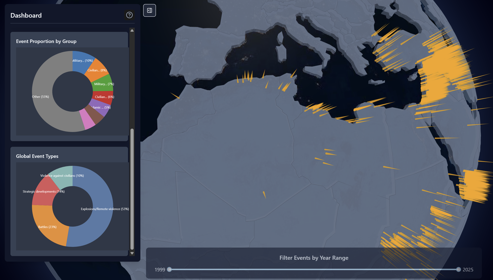

# MENA Interactive Geospatial Conflict Tracker

This is an interactive 3D data visualization of extremist activity and conflict events, primarily focusing on the Middle East and North Africa (MENA) region. This application allows users to explore event data across a timeline on a 3D globe, view aggregated statistics, and also view specific event details.

## Key Features

*   **Interactive 3D Globe:** Visualizes event clusters as 3D spikes, with height indicating event density.
*   **Timeline Control:** A slider to filter events by year range.
*   **Dynamic Clustering:** Event data is clustered geographically, with cluster granularity adjusting based on zoom level.
*   **Detailed Event Information:** Clicking on a cluster reveals a panel with a list of individual events, including descriptions.
*   **Dashboard Analytics:**
    *   Bar chart showing event counts per year (for the overall selected range or a specific cluster).
    *   Pie chart displaying event proportion by group (for the overall selected range or a specific cluster).
    *   Toggleable dashboard visibility.
*   **Hover Interactions:** Spikes on the globe highlight on hover, desaturating other spikes for focus.

## Data Source

The event data used in this visualization is sourced from the **Armed Conflict Location & Event Data Project (ACLED)**.
The specific dataset covers events from **1999 to May 2, 2025**, for the **Middle East and North Africa region**.

We extend our gratitude to ACLED for making their valuable data publicly available. Please refer to [acleddata.com](https://acleddata.com) for more information on their dataset and data collection methodology.

## Tech Stack

*   **Frontend:**
    *   React.js with Vite
    *   TypeScript
    *   Three.js & React Three Fiber (via `react-globe.gl`) for 3D globe visualization
    *   D3.js for data aggregation and rendering charts (Bar Chart, Pie Chart)
    *   TailwindCSS for styling
    *   `rc-slider` for the timeline component
    *   `shadcn/ui` components (Dialog, Button)
*   **Backend:**
    *   Node.js with Express.js
    *   MongoDB for data storage
*   **Data Processing (ETL):**
    *   Python (script: `scripts/process_data.py`)

## Gallery





## Setup and Running

### Prerequisites

*   Node.js and npm (or yarn)
*   Python 3.x (for the data processing script, if running ETL)
*   MongoDB instance (local or cloud-hosted, e.g., MongoDB Atlas)

### Backend Setup (Local Development)

1.  Ensure you are in the project root directory.
2.  All backend dependencies are now part of the main `package.json`. Install them by running `npm install` (or `yarn install`) in the project root if you haven't already.
3.  Create a `.env` file in the **project root directory** with your MongoDB URI and Port:
    ```env
    MONGO_URI=your_mongodb_connection_string
    PORT=3001 
    ```
    (Note: `PORT` is optional for Vercel deployment but used for local execution.)
4.  Start the backend server from the project root:
    ```bash
    node api/index.cjs
    ```
    The server will typically run on `http://localhost:3001`.

### Frontend Setup (Local Development)

1.  Navigate to the project root directory.
2.  Install dependencies (if not already done for backend): `npm install` (or `yarn install`)
3.  Ensure the backend server (`node api/index.cjs`) is running in a separate terminal. The frontend expects the API at `http://localhost:3001`.
4.  Start the frontend development server:
    ```bash
    npm run dev
    ```
    The application will typically be available at `http://localhost:5173`.

### Data Processing (One-time ETL)

1.  Ensure Python dependencies are installed (e.g., `pandas`, `pymongo`). You might use a virtual environment.
    If a `Pipfile` is present: `pipenv install && pipenv shell`
    Or with `requirements.txt`: `pip install -r requirements.txt` (create one if needed)
2.  Update the MongoDB connection string and CSV file path in `scripts/process_data.py` if necessary.
3.  Run the script: `python scripts/process_data.py`
    This will populate your MongoDB database with event data from the ACLED CSV.

---

This project aims to provide an insightful and interactive way to explore complex conflict data.
